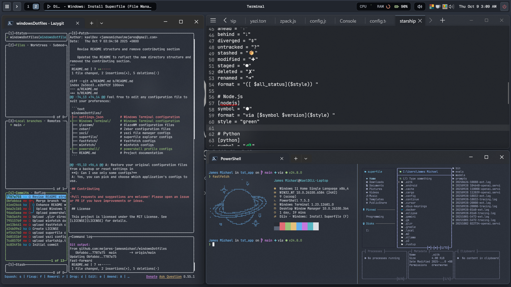
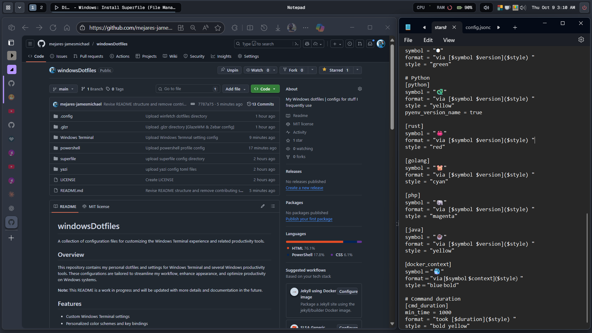
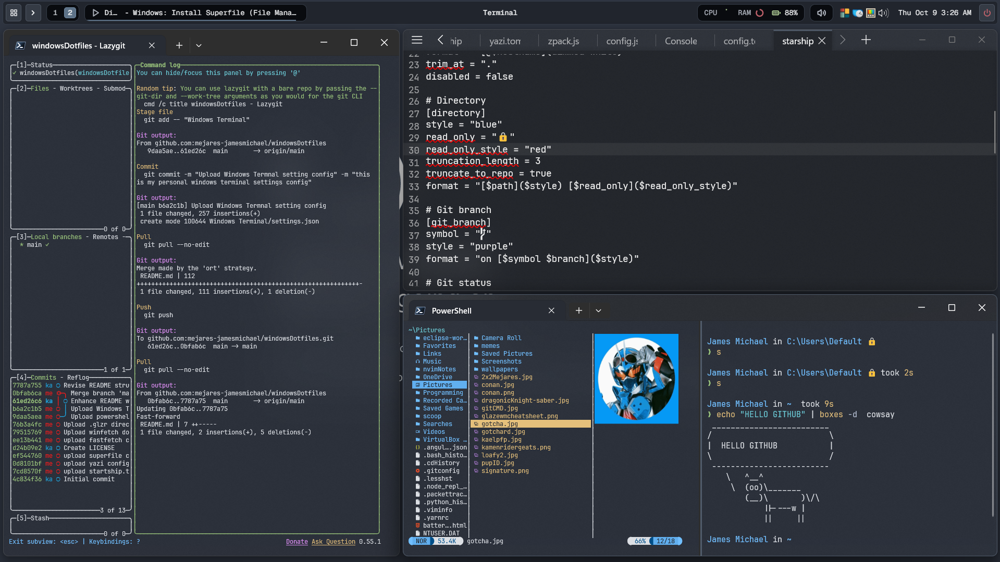

<details>
<summary>Spoiler</summary>
I am now using Komorebi(TWM) and YASB(Stats Bar)
</details>

# windowsDotfiles

A collection of configuration files for customizing the Windows Terminal experience and related productivity tools.

## Overview

This repository contains my personal dotfiles and settings for Windows Terminal and several Windows productivity tools. These configurations are tailored to streamline my workflow, enhance appearance, and optimize productivity on Windows systems.

**Note:** This README is a work in progress and will be updated with more details and documentation in the future.

## Preview

Here are some screenshots:





## Features

- Custom Windows Terminal settings
- Personalized color schemes and key bindings
- Startup actions and profile settings
- Easy-to-edit and extend configuration files
- Configuration support for:
  - [GlazeWM](https://github.com/glzr-io/GlazeWM): A tiling window manager for Windows
  - [Zebar](https://github.com/zebar-org/Zebar): Custom status bar for Windows
  - [yazi](https://github.com/sxyazi/yazi): Blazing fast terminal file manager
  - [superfile](https://github.com/sxyazi/superfile): Lightweight file explorer
  - [fastfetch](https://github.com/fastfetch-cli/fastfetch): Neofetch-like system info tool
  - [winfetch](https://github.com/kiedtl/winfetch): Windows system info fetcher
  - [lazygit](https://github.com/jesseduffield/lazygit): Git terminal
  - [Neovim](https://github.com/neovim/neovim): Terminal text editor

## Getting Started

### Prerequisites

- Windows 10/11
- [Windows Terminal](https://github.com/microsoft/terminal)
- [GlazeWM](https://github.com/glzr-io/GlazeWM)
- [Zebar](https://github.com/zebar-org/Zebar)
- [yazi](https://github.com/sxyazi/yazi)
- [superfile](https://github.com/sxyazi/superfile)
- [fastfetch](https://github.com/fastfetch-cli/fastfetch)
- [winfetch](https://github.com/kiedtl/winfetch)
- [lazygit](https://github.com/jesseduffield/lazygit)
- [Neovim](https://github.com/neovim/neovim)

> Follow the respective installation guides for each tool linked above.

### Installation

1. Clone this repository:
   ```sh
   git clone https://github.com/mejares-jamesmichael/windowsDotfiles.git
   ```
2. Locate the configuration directories for each application:
   - **Windows Terminal:**  
     `%LOCALAPPDATA%\Packages\Microsoft.WindowsTerminal_8wekyb3d8bbwe\LocalState`
   - **GlazeWM:**  
     `%USERPROFILE%\.glzr\.glazewm`
   - **Zebar:**  
     `%USERPROFILE%\.glzr\.zebar`
   - **yazi:**  
     `%USERPROFILE%\.config\yazi`
   - **superfile:**  
     `%USERPROFILE%\.config\superfile`
   - **fastfetch/winfetch:**  
     Usually run from command line; configs may be stored in user profile or specific folders.

3. Replace or merge the configuration files in this repo with your local settings for each tool.

4. Restart the applications to apply changes.

### Customization

Feel free to edit any configuration file to suit your preferences:
- Change color schemes, font size, or profile settings
- Add custom key bindings or shortcuts
- Adjust window manager layouts and status bar modules (GlazeWM, Zebar)
- Tweak file manager and explorer options (yazi, superfile)
- Edit system info display settings (fastfetch, winfetch)

## Repository Structure

```text
windowsDotfiles/
├── Windows Terminal      # Windows Terminal configuration
├── glazewm/              # GlazeWM configuration files
├── zebar/                # Zebar configuration files
├── yazi/                 # yazi file manager configs
├── superfile/            # superfile explorer configs
├── fastfetch/            # fastfetch configs
├── winfetch/             # winfetch configs
├── pictures/             # Screenshots and images for README
├── powershell/           # powershell profile config
└── README.md             # Project documentation
```

## FAQ

**Q: What does this repository configure?**  
A: Windows Terminal, plus configs for GlazeWM, Zebar, yazi, superfile, fastfetch, and winfetch.

**Q: How do I revert changes?**  
A: Restore your original configuration files from a backup or reset settings in the respective app.

**Q: Can I use only some configs?**  
A: Yes, you can pick and choose which application's configs to use.

## Contributing

Pull requests and suggestions are welcome! Please open an issue or PR if you have improvements or ideas.

## License

This project is licensed under the MIT License. See [LICENSE](LICENSE) for details.

## Author

[mejares-jamesmichael](https://github.com/mejares-jamesmichael)

---

_This README will be updated in the future with more detailed instructions and explanations._
